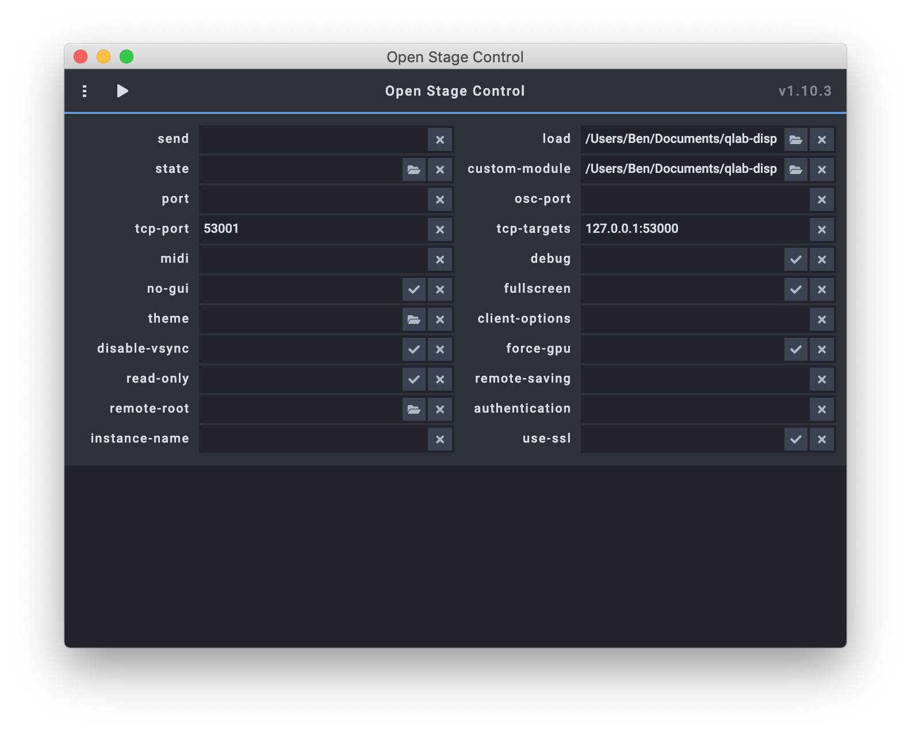
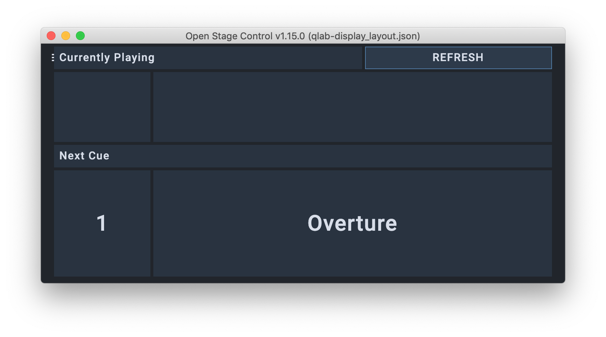
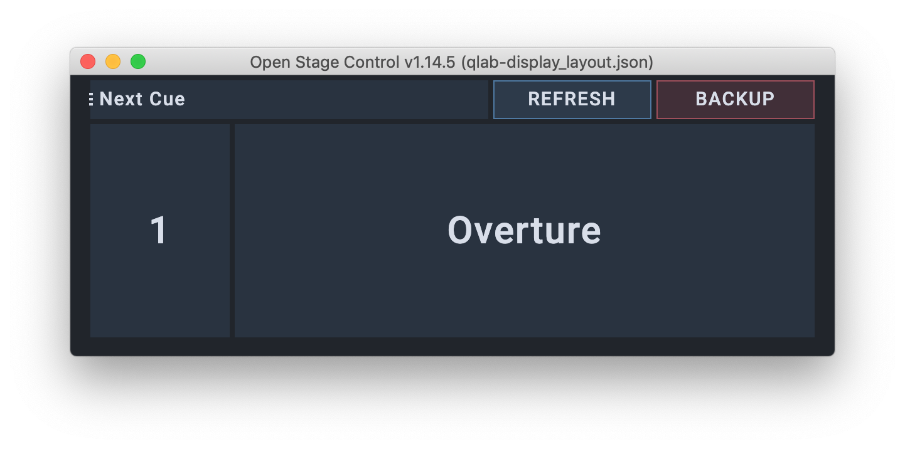
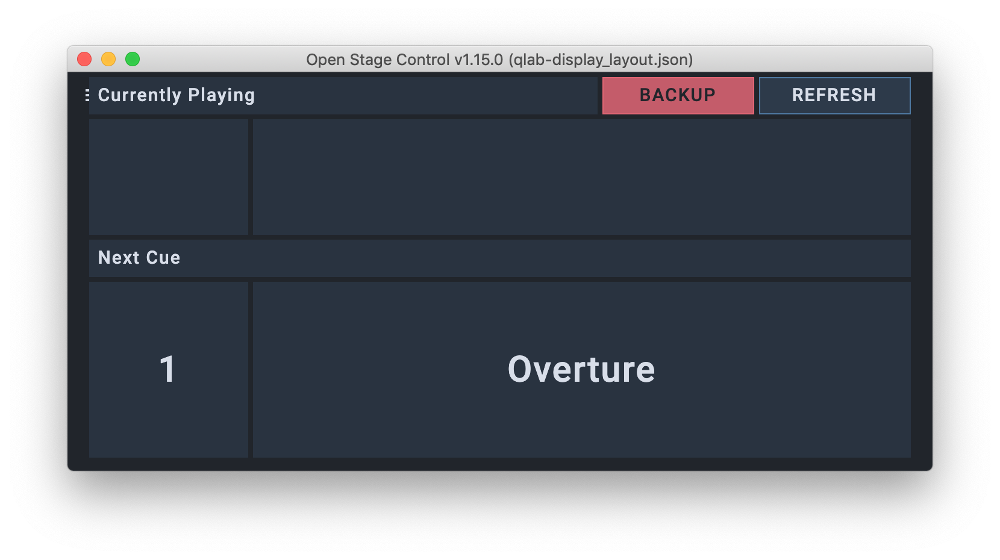
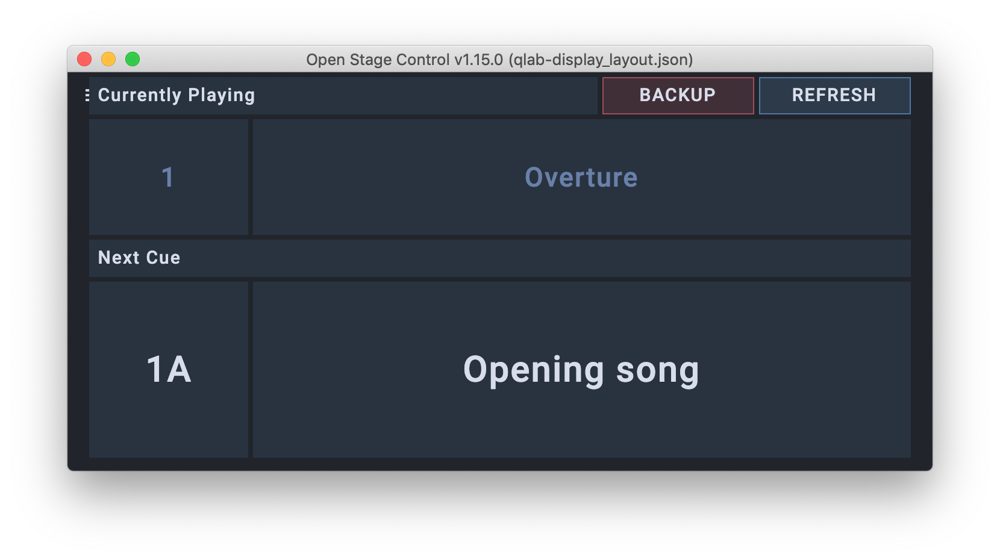
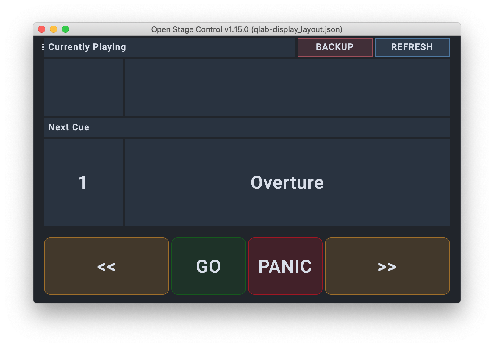
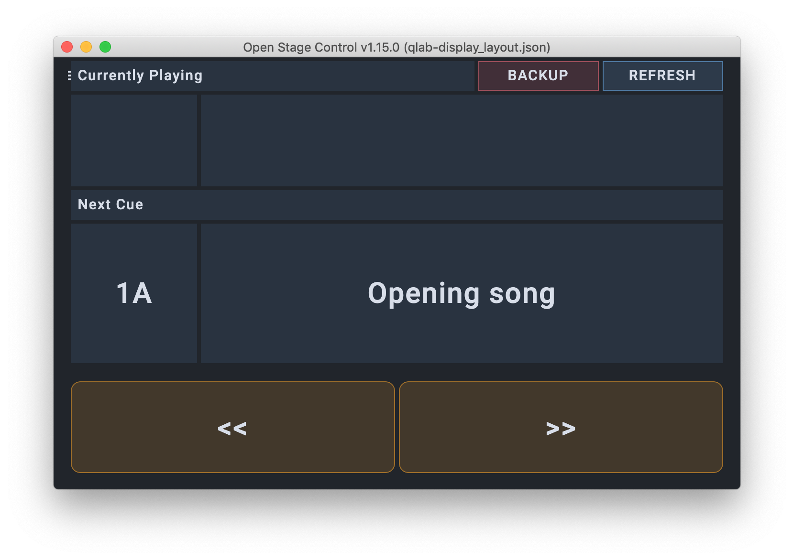

# QLab Display

> **NB**: If you are looking for the standalone Node.js version, check release v3.1.0 and earlier.

> **There is an alternative version of this repository at [github.com/bsmith96/qlab-display-separate-cue-list/](https://github.com/bsmith96/qlab-display-separate-cue-list/), which allows you to set separate trigger and playback cue lists.** This was forked from v4.2.2.

# Custom Module for Open Stage Control

This version runs entirely within the [Open Stage Control](http://openstagecontrol.ammd.net/) software, as a 'custom module'. It requests updates from QLab when there are changes to the workspace, and interprets the responses appropriately - the module ignores responses which do not relate to the playhead position of the chosen cue list.

You can run the module with either a UDP or TCP connection to QLab. I recommend using TCP, as this maintains a permanent connection to QLab, increasing reliability, but with minimal CPU overhead. If you wish to use UDP, you must send a thump (heartbeat) message to QLab to maintain the connection – to enable this, choose "UDP" when setting up the first applescript, or ensure `qlab-info-config.json` contains `control.useTCP = false`.

From *v4.1.0*, there is also the option for transport controls - either full transport (next, previous, go, panic) or reduced controls (next, previous). The intention would be for scenarios where the physical button is only a "Go" and "Stop", but the operator (e.g. MD) needs the ability to change the playhead. This will change the playhead on both the Main and Backup QLab macs simultaneously. 

## Open Stage Control setup

- First, put the repository folder on the computer you wish to run the web-server from. Ensure the computer is on the network, and file sharing is enabled. Port 53000 (and 53001 if using UDP) must be open.
- On your QLab computer, navigate to the above folder over the network and open '1-generate-module-config.applescript' in script editor.
  - Ensure your QLab file is open, and the front-most QLab workspace.
  - Run the script - this will create 'qlab-info-config.json' in the root folder.
  - The first dialog box asks you to define the QLab computer
    - If this is your only QLab computer, or if this is your "Main" or "A" machine, select "Main".
    - If you have a *main* and *backup* QLab computer, ensure you run this setup process on the *main* first, then repeat the process on the *backup*, selecting "Backup", to complete the config file.
  - The second dialog box allows you to choose the cue list you wish to monitor.
  - The third dialog box asks you which local IP address you wish to use. If your computer is on multiple networks, e.g. a control network and a [Dante](https://www.audinate.com/meet-dante/what-is-dante) network, this allows you to select the correct one.
    - **NB**: 127.0.0.1 is the localhost address.
    - **NB**: If you can only see 127.0.0.1, try cmd+F "set theIPs to splitString(theReturned". Replace the line break (between the 2 quote marks) with `\r` and re-compile, and save.
  - When setting up the Main QLab computer, you will also be asked:
    - Whether you want to use a TCP or UDP connection.
    - Whether you want any transport controls.
- If you are running the server on a mac:
  - On the computer running the server, open '2-generate-app-config.applescript' in script editor, and run the script. This will create 'qlab-display.config'.
  - Open **Open Stage Control**.
  - Select *Load* and open 'qlab-display.config'.
  - Click start to launch the OSC & web server.
- If you are running the server on a non-mac computer:
  - Set the following settings in the launcher:
    - **load**: select the file `qlab-display_layout.json`
    - **custom-module**: select the file `qlab-display_module.js`
    - **port**: this is the port that the web server is served to. Leave this blank to use the default 8080.
    - **no-gui**: if you do not want the display open on the device which is the server, set this to true.
    - **IF USING UDP**
      - **osc-port**: set 53001. This is the port it will listen for replies from.
    - **IF USING TCP**
      - **tcp-port**: set 53001. 
      - **tcp-targets**: set \[QLab IP\]:53000 (e.g. `127.0.0.1:53000`). Use a space to separate multiple instances, e.g. Main and Backup.
  - Now, click start to launch the OSC & web server.

If you ever need to re-generate 'qlab-info-config.json', you can simply run the process again. This might happen if you bundle the workspace.

## Suggested use case

My suggested setup is to run the Open Stage Control server at Front Of House (for example, on the System computer), with the local GUI active, so the Sound Operator can see that it is working correctly. Then, the remote display for the MD is simply a browser window.

This has the added advantage that, if the Sound Operator needs to switch to the Backup QLab computer, they can hit the "BACKUP" button on the viewer, which also switches it for the MD.

# Screenshots

## Launching Open Stage Control Module (single QLab mac, using TCP)

## Module - single QLab

## Module - Redundant Qlab

### Redundant QLab - Main

### Redundant QLab - Backup

## Module - Currently Playing

## Transport Controls

### Transport - Full

### Transport - Reduced

